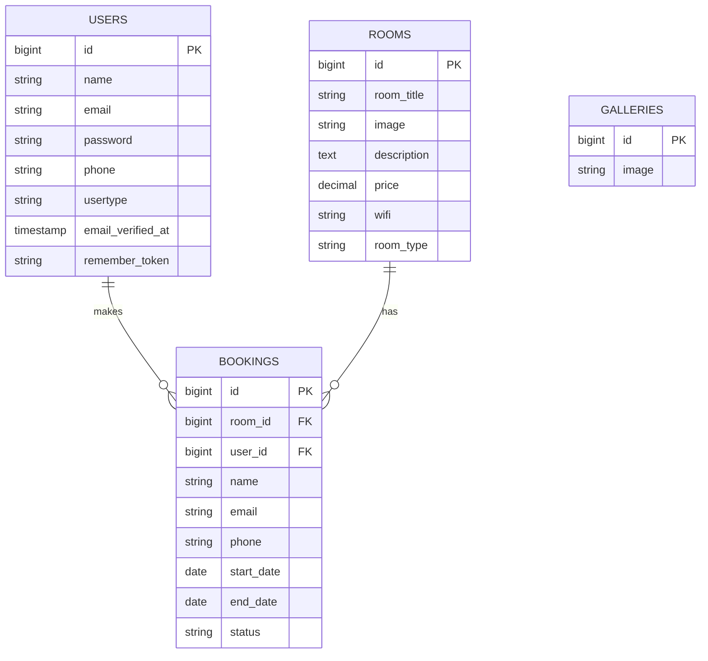
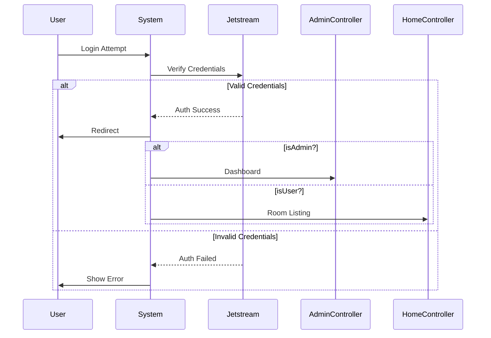
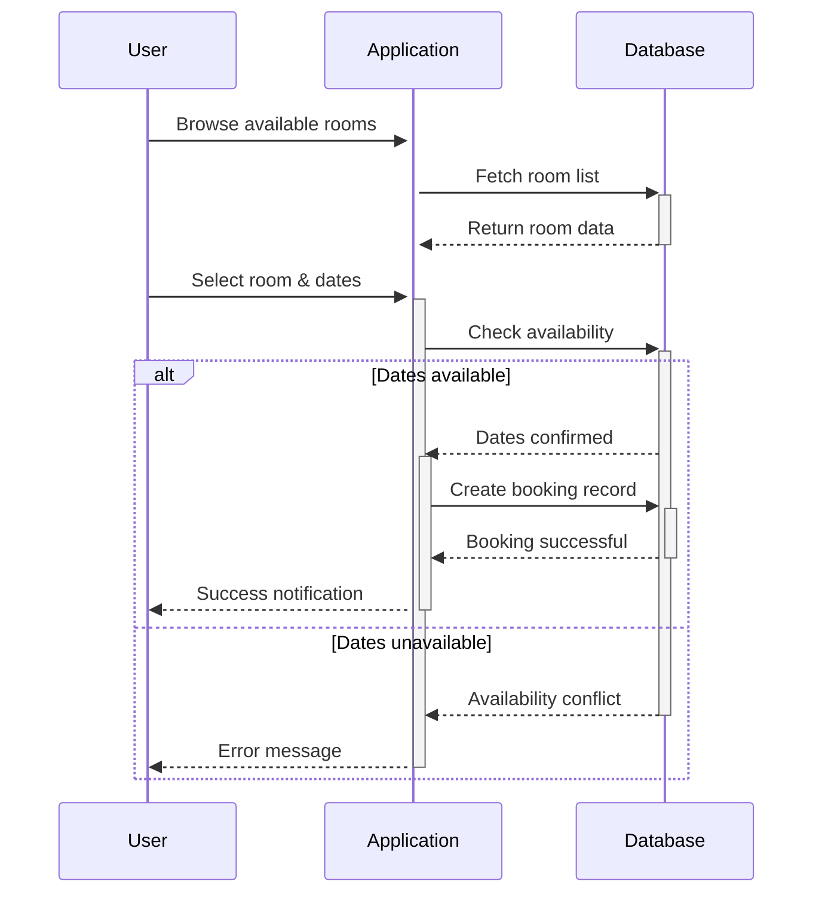
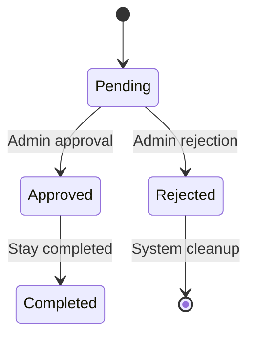

# Hotel Management System 🏨

## Overview 🌐

A comprehensive Laravel-based web application for managing hotel room bookings, gallery content, and user interactions. The system provides role-based access control with separate functionalities for administrators and regular users.

### Key Features ✨

- **User Management**
  - Role-based authentication (Admin/User)
  - Profile management with 2FA support
- **Room Management**
  - CRUD operations for rooms
  - Image upload capabilities
  - Detailed room descriptions with amenities
- **Booking System**
  - Date range validation
  - Booking status management (Approve/Reject)
  - Conflict checking for overlapping reservations
- **Gallery Management**
  - Image upload and deletion
  - Public gallery display
- **Responsive UI**
  - Mobile-friendly interface
  - Admin dashboard with analytics

## Technologies Stack 🛠️

- **Backend**
  - Laravel 10.x
  - Laravel Jetstream (Authentication)
  - Laravel Sanctum (API Tokens)
- **Frontend**
  - Blade Templates
  - Tailwind CSS
- **Database**
  - MySQL
  - Eloquent ORM
- **Other**
  - Mermaid.js (Documentation diagrams)
  - Intervention Image (Image handling)

## Installation 💻

```bash
# Clone repository
git clone https://github.com/yourusername/hotel-management-system.git
cd hotel-management-system

# Install dependencies
composer install
npm install

# Environment setup
cp .env.example .env
php artisan key:generate

# Configure database in .env
DB_DATABASE=your_database
DB_USERNAME=your_username
DB_PASSWORD=your_password

# Run migrations
php artisan migrate --seed

# Create storage link
php artisan storage:link

# Start development server
php artisan serve
```

### Core Components

```
app/
├── Controllers
│   ├── AdminController (Rooms/Bookings/Gallery)
│   └── HomeController (User operations)
├── Models
│   ├── User (Authentication)
│   ├── Room (Property management)
│   ├── Booking (Reservations)
│   └── Gallary (Promotional content)
└── Providers
    ├── Jetstream (Auth configuration)
    └── Fortify (User management)
```

## Database Schema 🗄️



## System Workflows 🔄

### Authentication Flow



### User Booking Process



### Admin Approval Process



## Key Technical Components 🧩

### Authentication Flow (Jetstream)

```php
// User model with 2FA support
class User extends Authenticatable {
    use HasApiTokens;
    use HasFactory;
    use HasProfilePhoto;
    use Notifiable;
    use TwoFactorAuthenticatable;
}
```

### Room Management (AdminController)

```php
public function add_room(Request $request) {
    $data = new Room();
    $data->room_title = $request->title;
    // ... other fields
    if($image) {
        $imagename = time().'.'.$image->getClientOriginalExtension();
        $request->image->move('room',$imagename);
        $data->image = $imagename;
    }
    $data->save();
}
```

### Booking Validation

```php
$isBooked = Booking::where('room_id',$id)
    ->where('start_date', '<=',$endDate)
    ->where('end_date', '>=',$startDate)
    ->exists();
```


## Contact 📧

**Project Maintainer**: [Your Name]  
[](https://www.linkedin.com/in/yourprofile)
